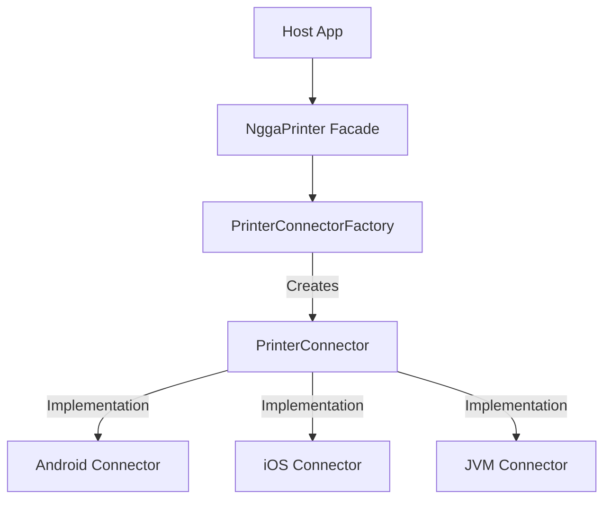

# 🖨️ NggaPrinter
**The Ultimate Kotlin Multiplatform Thermal Printing Suite.**

[](https://kotlinlang.org/docs/multiplatform.html)
[](https://opensource.org/licenses/MIT)

NggaPrinter is a high-performance, developer-centric library for ESC/POS thermal printing across **Android, iOS, JVM (Desktop), and Web**. Built with a unified **Connector Architecture**, it simplifies hardware integration into a robust, reactive experience.

---

## ✨ Key Features
- 🚀 **Unified API**: One facade (`NggaPrinter`) for all connection types.
- 📡 **Reactive Discovery**: Flow-based discovery for Bluetooth, USB, and Network devices.
- 🎨 **Precision Layouts**: Precision-engineered text alignment for 58mm and 80mm paper widths.
- 🔗 **Modern Printing**: Native support for **QR Codes**, **Barcodes**, and **Accounting Breakdowns**.

---

## 🏗️ Architecture Overview

NggaPrinter follows a decoupled, factory-based architecture ensuring maximum portability and testability.



---

## 🚀 Quick Start

### 1. Installation
Copy the `printer` module into your project and include it in your `settings.gradle.kts`:
```kotlin
include(":printer")
```

### 2. Discovery & Printing
```kotlin
val printer = NggaPrinter()

// Reactive discovery
printer.connectorFactory.discovery("BLUETOOTH") { log ->
    println(log)
}.collect { devices ->
    // Update Your UI
}

// Seamless Printing
val config = PrinterConfig(name = "MTP-II", connectionType = "BLUETOOTH", address = "00:11:22...")
scope.launch {
    printer.printReceipt(config, businessInfo, receiptData)
}
```

---

## 📚 Deep Dive
For detailed setup, platform permissions, and advanced layout customization, refer to:
👉 **[DOCS_AND_SAMPLE.md](./DOCS_AND_SAMPLE.md)**

---

## ⚖️ License
This project is licensed under the MIT License.

Developed with ❤️ by **Ringga**